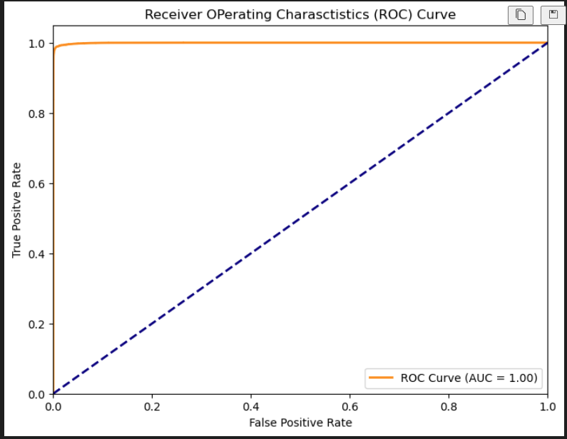

# Credit Card Fraud Detection 🕵️‍♂️💳

This project applies **Random Forest Classification** to detect fraudulent credit card transactions using Python and scikit-learn.

## 📌 Problem Statement

Credit card fraud is a serious issue. The goal of this project is to build a machine learning model that can effectively distinguish between **genuine** and **fraudulent** transactions.

## 🔧 Tools & Technologies

- Python
- Pandas & NumPy
- scikit-learn
- Seaborn & Matplotlib
- Jupyter Notebook or VScode

## 📊 Dataset

The dataset contains real credit card transactions made by European cardholders in September 2013.

> **Note:** Due to file size and sensitivity, the dataset is not included in this repo. You can download it from [Kaggle - Credit Card Fraud Detection](https://www.kaggle.com/datasets/mlg-ulb/creditcardfraud).

## 📈 Project Workflow

1. Data Cleaning & Exploration
2. Feature Scaling & Handling Imbalance (if any)
3. Model Training using Random Forest
4. Evaluation using Confusion Matrix, Classification Report, and ROC AUC

## 🧠 Key Takeaways

- F1 Score, ROC-AUC used due to class imbalance
- Model tuning with cross-validation and hyperparameter optimization

## 📁 Folder Structure

- `notebooks/`: Notebook with all analysis
- `data/`: (User must download dataset)
- `images/`: Optional — saved ROC/AUC plots, etc.

---

## ✅ Output Sample

---

## 🚀 Future Improvements

- Try SMOTE or other resampling techniques
- Compare with Logistic Regression / XGBoost
- Deploy with Streamlit or Flask

## 🤝 Let's Connect!

Feel free to connect with me on [LinkedIn](your-link) or check out more of my work on [GitHub](your-github-url).
